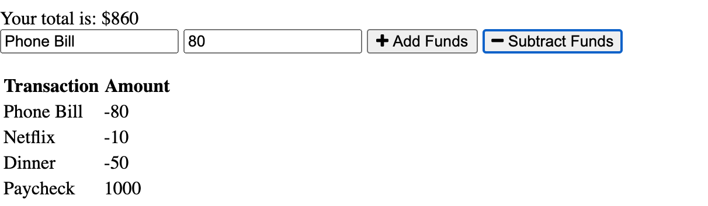

# Budget-Tracker

## Description

This is an application that provides the user with the ability to track their deposits and expenses with or without a connection. When entering transactions offline, they should populate the total when brought back online.

**## Table of Contents**

1. [Installation Instructions](#installation-instructions)
2. [Usage Information](#usage-information)
3. [Test Instructions](#test-instructions)
4. [Questions](#questions)

## Installation Instructions

If SSH keys are installed, you can install the program by cloning it to your local machine by running git clone git@github.com:dolanpettit/Budget-Tracker.git. Once you have succesfully cloned to your local machine, be sure to install all required dependencies for application by running "npm i" in the command line.

## Usage Information

This application is deployed on Heroku and can be accessed by visiting this link:

## Test Instructions

There are currently no testing suites for this application.

# Questions

For any questions about this assignment, feel free to reach out to me on github or my email.

https://github.com/dolanpettit

dolanpettit@gmail.com
